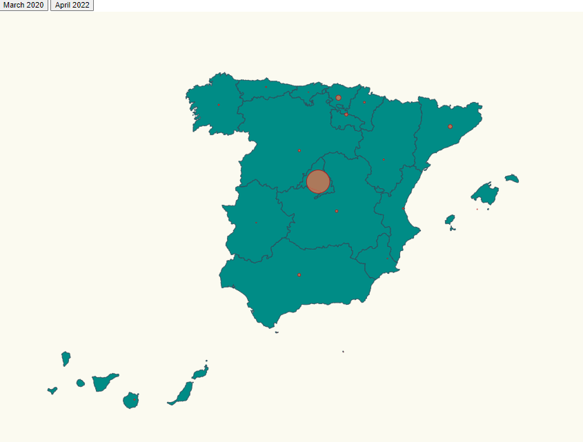

# COVID-19: Evolution of cases in Spain by region


# Map of COVID-19 cases in Spain by region.

The map graphically represents the cases of COVID-19 that have been reported in each of the Autonomous Communities of Spain. 

If we click on the "March 2020" button we will obtain the representation of the cases reported as of March 13, 2020. If we click on the "April 2022" button, the cases reported a few days ago are represented, specifically with data updated as of April 17. 

The data have been obtained from the website of the Government of Spain.

# Previous installation steps

```bash
npm install

npm install topojson-client --save

npm install @types/topojson-client --save-dev

npm install d3-composite-projections --save

npm install @types/node --save-dev

npm start
```

### Maximum number of infections in each of the Autonomous Communities:

```typescript
const calculateMaxAffected = (dataset: ResultEntry[]) => {
  return dataset.reduce(
    (max, item) => (item.value > max ? item.value : max),
    0
  );
};
```

### Maximum radius depending on the number of infections in each of the Autonomous Communities:

```typescript
const calculateAffectedRadiusScale = (maxAffected: number) => {
  return d3.scaleLinear().domain([0, maxAffected]).range([0, 20]);
};
```

### Scale of the radius depending on the number of infections in each of the Autonomous Communities:

```typescript
const calculateRadiusBasedOnAffectedCases = (comunidad: string, dataset: ResultEntry[]) => 
{
  const maxAffected = calculateMaxAffected(dataset);
  const affectedRadiusScale = calculateAffectedRadiusScale(maxAffected);
  const entry = dataset.find((item) => item.name === comunidad);
  const adder = d3
    .scaleThreshold<number, number>()
    .domain([50000, 100000, 500000, 1000000, 5000000])
    .range([0.2, 0.4, 2, 4, 20]);

  return entry ? affectedRadiusScale(entry.value) + adder(maxAffected) : 0;
};
```
### Creation of the buttons for the two data configurations (March 2020 and April 2022):

```typescript
const updateChart = (dataset: ResultEntry[]) => {
  svg
    .selectAll("circle")
    .data(latLongCommunities)
    .attr("class", "affected-marker")
    .attr("cx", (d) => aProjection([d.long, d.lat])[0])
    .attr("cy", (d) => aProjection([d.long, d.lat])[1])
    .transition()
    .duration(800)
    .attr("r", (d) => calculateRadiusBasedOnAffectedCases(d.name, dataset));
};
```


```typescript
document
  .getElementById("initial")
  .addEventListener("click", function handleInitialStats() {
    updateChart(march2020data);
  });

document
  .getElementById("final")
  .addEventListener("click", function handleFinalStats() {
    updateChart(april2022data);
  });
```
# The result obtained is to be able to make a graphic comparison of both stages of COVID-19, as can be seen through these two representations:

# March 2020



# April 2022

